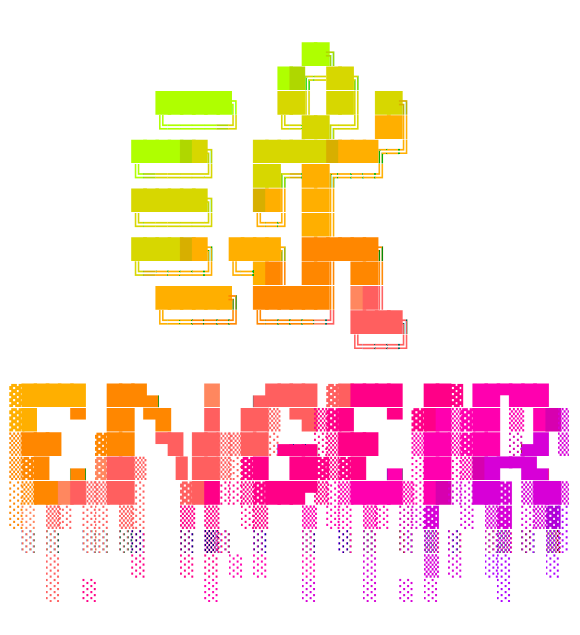

# Stowfiles

<!-- rich-codex --skip-git-checks --use-pty --hide-command --terminal-width 46 --head 24 -->
<!--  -->
<!--  -->
<div align="center">

</div>

[](https://github.com/pre-commit/pre-commit)

## NeoVim

The by far most updated directory/config is the NeoVim config. Have a closer look at it
[here](./nvim_lua/.config/nvim/).

## Install

For Ubuntu:

```sh
make install-ubuntu
```

For Mac:

```sh
make install-mac
```

Or install any one folder/files:

```sh
stow zsh
```

## Other

Update the `apt` list of packages:

```sh
dpkg --get-selections
```

Update the `brew` list of packages:

```sh
brew list
```
